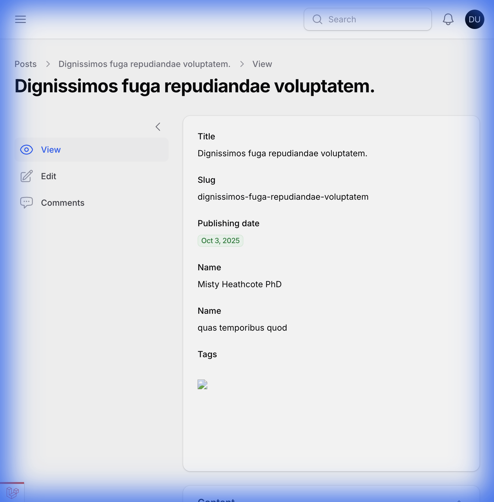
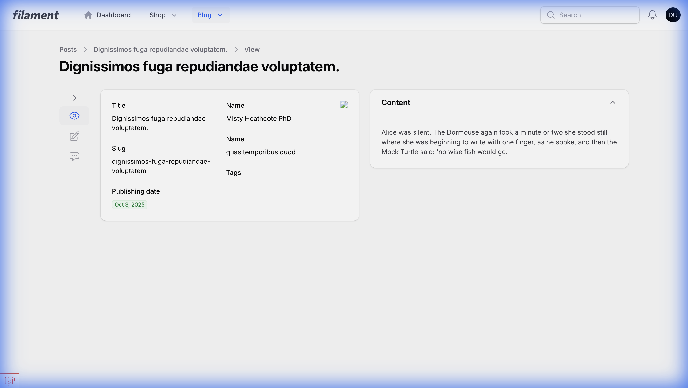

# Filament Collapsible Sub-Navigation

A Filament v4 plugin that provides a collapsible sidebar for sub-navigation pages (e.g., when using `->subNavigationPosition(SubNavigationPosition::Start)`). It persists state across reloads via cookies, supports server-side rendering to prevent FOUC, and is responsive.




## Installation

You can install the package via composer:

```bash
composer require emuniq/filament-collapsible-subnav
```

## Usage

### 1. Register the Plugin
In your `AdminPanelProvider` (e.g., `app/Providers/Filament/AdminPanelProvider.php`), register the plugin:

```php
use Emuniq\FilamentCollapsibleSubnav\CollapsibleSubnavPlugin;

public function panel(Panel $panel): Panel
{
    return $panel
        // ...
        ->plugin(new CollapsibleSubnavPlugin());
}
```

### 2. Import CSS
Add the plugin's CSS to your theme's stylesheet (e.g., `resources/css/filament/admin/theme.css`).
This plugin uses Tailwind CSS v4 `@source` directives.

```css
@import '../../../../vendor/emuniq/filament-collapsible-subnav/resources/css/theme.css';
```
*(Note: Adjust the path if necessary. If developing locally via `path` repository, use the relative path to your packages folder).*

### 3. Override Layout
To apply the collapsible layout, you must override Filament's base layout component.
Create `resources/views/vendor/filament-panels/components/layout/base.blade.php` with the following content:

```blade
@props([
    'livewire' => null,
])

<x-filament-collapsible-subnav::layout :livewire="$livewire" :attributes="$attributes">
    {{ $slot }}
</x-filament-collapsible-subnav::layout>
```

This effectively wraps your panel in the collapsible sub-navigation layout.

## Publishing & Updates

### Push to GitHub
If you have local changes, push them to the repository:

```bash
git push origin main
```

### Packagist & GitHub Hook
To automatically update Packagist when you push to GitHub:
1.  Log in to [Packagist.org](https://packagist.org) using your GitHub account.
2.  Submit your repository URL: `https://github.com/Emuniq/filament-collapsible-subnav`.
3.  **Automatic Hook:** If you logged in via GitHub, Packagist should automatically set up the service hook.
4.  **Manual Hook:** If needed, go to your GitHub Repo -> **Settings** -> **Webhooks**.
    *   Add user `packagist` (if using the "Integrations" section) or set Payload URL to `https://packagist.org/api/github?username=Emuniq`.
    *   Content type: `application/json`.
    *   Secret: (Your Packagist API Token).
    *   Events: `push`.

## License

The MIT License (MIT). Please see [License File](LICENSE.md) for more information.
