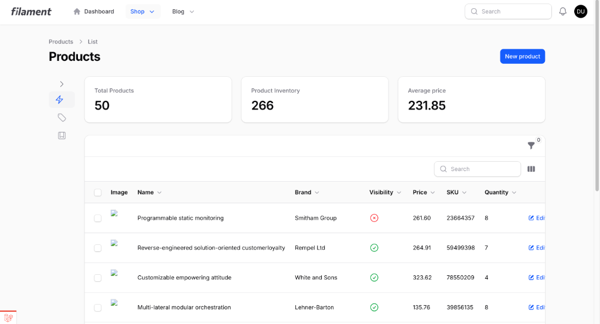

# Filament Collapsible Sub-Navigation

A Filament v4 plugin that provides a collapsible sidebar for sub-navigation pages (e.g., when using `->subNavigationPosition(SubNavigationPosition::Start)`). It persists state across reloads via cookies, supports server-side rendering to prevent FOUC, and is responsive.




## Installation

You can install the package via composer:

```bash
composer require emuniq/filament-collapsible-subnav
```

## Usage

### 1. Register the Plugin
In your `AdminPanelProvider` (e.g., `app/Providers/Filament/AdminPanelProvider.php`), register the plugin:

```php
use Emuniq\FilamentCollapsibleSubnav\CollapsibleSubnavPlugin;

public function panel(Panel $panel): Panel
{
    return $panel
        // ...
        ->plugin(new CollapsibleSubnavPlugin());
}
```

### 2. Create or Update Theme CSS
If you don't have a custom theme yet, create one:

```bash
php artisan make:filament-theme
```

Then add the plugin's CSS to your theme's stylesheet (e.g., `resources/css/filament/admin/theme.css`):

```css
@import '../../../../vendor/emuniq/filament-collapsible-subnav/resources/css/theme.css';
```

After importing, rebuild your assets:

```bash
npm run build
```

### 3. Publish and Override Layout
Publish Filament's views (if not already done):

```bash
php artisan vendor:publish --tag=filament-panels-views
```

Then edit `resources/views/vendor/filament-panels/components/layout/base.blade.php` and replace its content with:

```blade
@props([
    'livewire' => null,
])

<x-filament-collapsible-subnav::layout :livewire="$livewire" :attributes="$attributes">
    {{ $slot }}
</x-filament-collapsible-subnav::layout>
```

This effectively wraps your panel in the collapsible sub-navigation layout.

## Requirements

- PHP 8.1+
- Laravel 10.0+
- Filament 4.0+
- A Filament resource or page using `->subNavigationPosition(SubNavigationPosition::Start)`

## Features

- ✅ Collapsible sidebar toggle button
- ✅ Persistent state using cookies
- ✅ Server-side rendering support (no FOUC)
- ✅ Responsive design
- ✅ Smooth animations


## License

The MIT License (MIT). Please see [License File](LICENSE.md) for more information.
