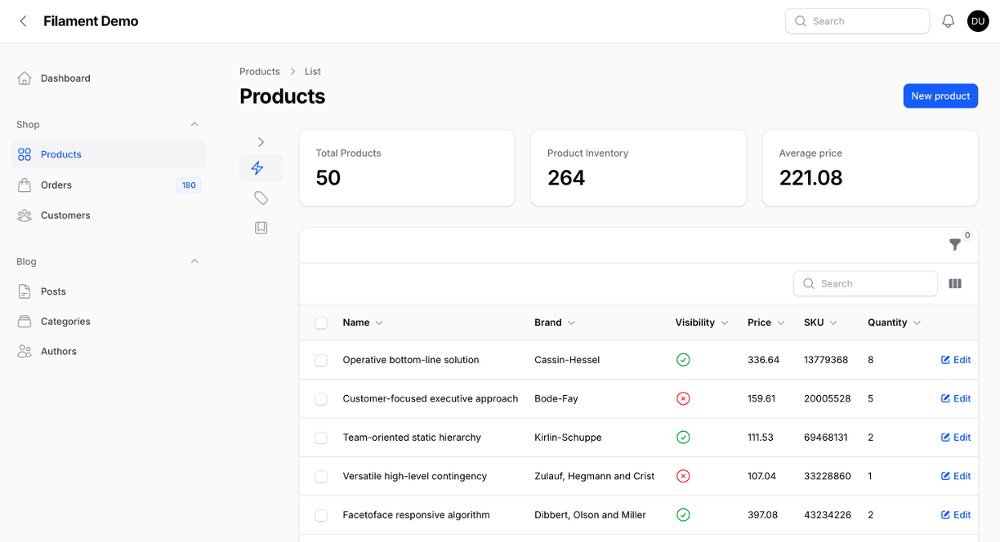
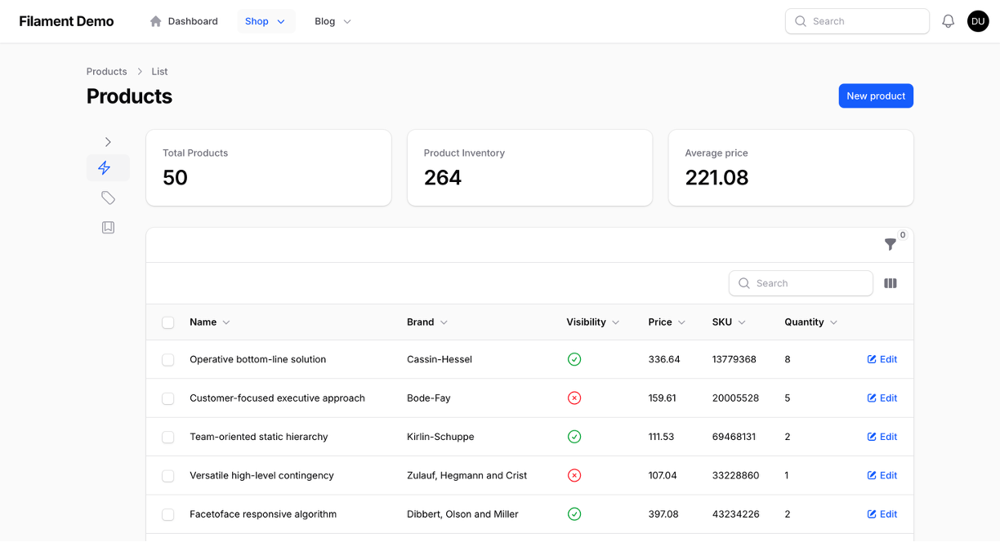

# Filament Collapsible Sub-Navigation

[](https://packagist.org/packages/emuniq/filament-collapsible-subnav)
[](https://packagist.org/packages/emuniq/filament-collapsible-subnav)
[](https://packagist.org/packages/emuniq/filament-collapsible-subnav)
[](LICENSE.md)
[](https://packagist.org/packages/emuniq/filament-collapsible-subnav)

A Filament v3, v4 & v5 plugin that adds a collapsible toggle to **sub-navigation sidebars only**. Perfect for resource pages with multiple tabs or sections using `->subNavigationPosition(SubNavigationPosition::Start)`.

Works with **both top navigation and sidebar navigation** layouts — the plugin specifically targets the sub-navigation sidebar that appears on individual resource pages, not the main panel navigation.

**Without Top Navigation (Sidebar Layout):**


**With Top Navigation:**


## Compatibility

| Plugin version | Filament      | PHP    | Laravel        |
| -------------- | ------------- | ------ | -------------- |
| `^1.0`         | v3, v4, v5    | 8.1+   | 10 / 11 / 12 / 13 |

**Note:** This plugin only affects **sub-navigation sidebars** (the secondary navigation within resource pages), not the main panel sidebar. It works regardless of whether you use top navigation or sidebar navigation for your main panel layout.

## Installation

Install the package via composer:

```bash
composer require emuniq/filament-collapsible-subnav
```

**That's it!** The plugin auto-registers to all panels and works immediately with zero flash.

### Optional: Theme Integration

For a slight performance boost, you can integrate the CSS into your Filament theme:

```bash
php artisan collapsible-subnav:install
npm run build
```

This bundles the plugin CSS with your theme, reducing HTTP requests. **Not required** — the plugin works perfectly without this step.

## Features

- ✅ **Zero configuration** — Auto-registers to all panels
- ✅ Collapsible sub-navigation sidebar toggle
- ✅ Persistent state using cookies (server-side rendered to avoid FOUC)
- ✅ Works with SPA mode (`livewire:navigated` re-sync)
- ✅ Tooltips for collapsed items (native fallback for v4, Tippy for v3)
- ✅ Responsive — hidden on mobile (<768px)
- ✅ Smooth transitions
- ✅ No theme, npm, or build step required

## How It Works

The plugin automatically:
1. Registers itself to all Filament panels on installation
2. Injects critical CSS in the `<head>` to prevent flashes on reload
3. Adds a toggle button to **sub-navigation sidebars only** (not main panel navigation)
4. Persists the collapsed/expanded state via the `subnav_collapsed` cookie
5. Re-syncs after each Livewire SPA navigation

The plugin detects pages with sub-navigation and only applies to those specific sidebars, leaving your main panel navigation (top or sidebar) untouched.

## Manual Registration (Optional)

If you prefer manual control, you can register the plugin explicitly on individual panels:

```php
use Emuniq\FilamentCollapsibleSubnav\CollapsibleSubnavPlugin;

public function panel(Panel $panel): Panel
{
    return $panel
        // ...
        ->plugin(CollapsibleSubnavPlugin::make());
}
```

## Troubleshooting

**Cloudflare Rocket Loader strips the early script.** The plugin marks its critical inline script with `data-cfasync="false"` so Rocket Loader skips it. If you still see a flash on reload, check that your CDN or HTML minifier preserves the attribute.

**SPA mode (`->spa()`) leaves the toggle out of sync.** Fixed since the SPA re-sync patch — the plugin now listens to `livewire:navigated` and re-applies state on every navigation.

**Tooltips don't appear in Filament v4.** Filament v4 doesn't expose Tippy globally; the plugin falls back to the native HTML `title` attribute so a tooltip always shows on hover.

## Contributing

Issues and pull requests are welcome on [GitHub](https://github.com/Emuniq/filament-collapsible-subnav). For bugs, please include your Filament version, PHP version, and a minimal reproduction.

## Maintained by Emuniq

This plugin is built and maintained by **[Emuniq](https://emuniq.com)** — a Laravel & Filament consultancy based in Mexico. We help teams ship admin panels, custom Filament resources, and SaaS backoffices.

- 🌐 Website: [emuniq.com](https://emuniq.com)
- 💼 Need a hand with your Filament project? [Get in touch](https://emuniq.com).
- ⭐ If this plugin saves you time, a GitHub star helps others find it.

## License

The MIT License (MIT). Please see [LICENSE.md](LICENSE.md) for more information.
